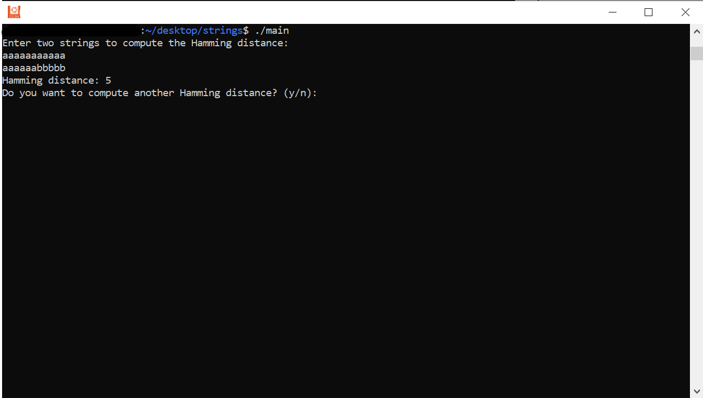
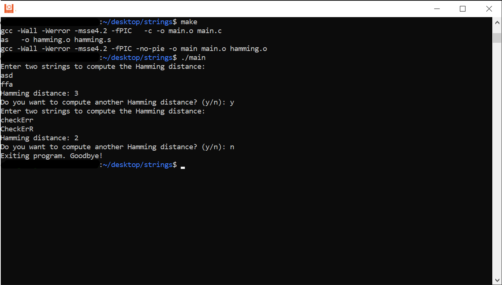

# Hamming Distance Calculator

This project is a simple and efficient implementation of a program to calculate the **Hamming distance** between two strings using **assembly optimization** and a C interface.

The Hamming distance measures the number of differing positions between two strings of equal length. This project leverages **SSE4.2** instructions for optimized performance, making it both a great academic exercise and a practical utility for comparing strings.

---

## **Features**
- Efficient calculation of the Hamming distance using assembly (`hamming.s`).
- Interactive C-based interface (`main.c`) to take input from the user.
- Dynamic memory handling for strings up to 256 characters.
- Assembly code optimized with **bit manipulation** and **SSE instructions**.
- Support for different length strings (even tho its not the purpose of Hamming Distance)

---

## **Project Structure**
```
project-folder/
├── main.c
├── libstr.h
├── hamming.s
├── Makefile
├── README.md
└── screenshots/
    ├── 1.png
    └── 2.png
```

---

## **Installation and Compilation**
1. Clone the repository:
   ```bash
   git clone https://github.com/your-repo/hamming-distance.git
   cd hamming-distance
   ```

2. Compile the project using **Make**:
   ```bash
   make
   ```

3. Run the program:
   ```bash
   ./main
   ```

---

## **Usage**
1. The program will prompt you to enter two strings.
2. It will compute and display the Hamming distance.
3. After each computation, you can choose to perform another calculation or exit.

Example:
```
Enter two strings to compute the Hamming distance:
hello 
hxlxo
Hamming distance: 2
Do you want to compute another Hamming distance? (y/n): n
Exiting program. Goodbye!
```

---

## **Screenshots**
- **Program Input:**

  

- **Program Input:**

  


---

## **How It Works**
The program uses a combination of **C** and **assembly** to compute the Hamming distance:
- `main.c`: Handles user interaction and input.
- `hamming.s`: Uses efficient bitwise operations and **SSE4.2 instructions** to compare 16-byte chunks of the input strings and count differences.

The comparison logic is optimized using:
- **`pcmpistrm` instruction:** Quickly identifies differing bytes.
- **Bit-counting algorithm:** Tallies the differences efficiently.

---

## **Cleaning Up**
To clean the project files (object files and executable):
```bash
make clean
```

---

## **Future Improvements**
- Extend support for larger strings.
- Handle strings of varying lengths by padding or truncation (and not with distances compre).
- Transforming the Len function to be SSE as well. 
- Include error handling for non-ASCII characters.


